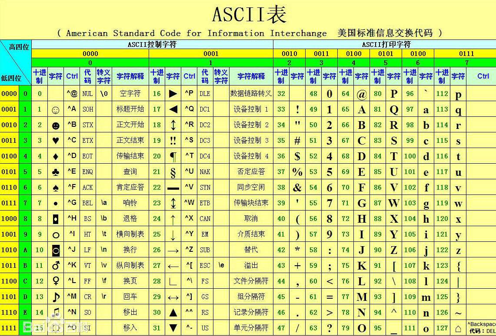

#### jre:  java  runtime environment  
####  使用jdk完成java程序  交给jre去运行

##### 为什么jdk里面包含了一 jre?

## java文件执行的过程：
### 1.对.java文件进行编译（预先检查java语法）,如果编译没问题则编译通过
### 2.对编译之后的class 文件进行执行
### 注意:class 后面的名字要和java文件名一致

  /* java文件的结构:
            修饰符  class  类名{
                代码;  每一行代码都要以分号结尾
                
             }
     *
     *
     */
    
## 关键字
    被java赋予特殊含义的词(比如 FirstJava文件里面的棕黄色的单词)
    特点:英文字母全部小写
    注意：goto  const 为保留关键字（目前不使用）
    
    图:
 
## 标识符
   就是给类  接口   方法  变量等等 起名字使用的字符序列
   取名字的规则:
        英文大小写字母
        数字字符
        $和_
   注意事项：
        不能以数字开头
        不能是java的中关键字
        区分大小写
     Class  $c_12 12_f  int  Hello World 
     包：小写字符 cn_cnm    cnCnm 
        一个单词的时候 字母全部小写  一个以上的时候 从第二个单词开始首字母大写
     类：一个单词的时候首字母大写    一个以上单词组合 单词首字母都是大写
        FirstNumber   First_number         
        
     变量:  一个单词,如果是字符开头可以大小写（默认小写）
            两个单词及以上 从第二个单词开始首字母大写
            可以$  _开头 还可以 字符+数字 组合
## 注释
    单行注释
    多行注释
    文档注释
                
        /**
         * @Author sanye
         * @deprecated  对于你所写代码的描述
         * @since  1.2
         * @date   代码所写的时间
         * 
         * 
         * */
    
## 常量  进制和进制的转换
    什么叫常量？在程序执行的过程中其值是不能变的
    字面值常量
        34   12.4  56.4  数字常量
        字符常量  'a'  'd'  'w'
        "asdafaw哈哈哈"  字符串常量
        数字字符  '3'   数字字符串"21" 
        布尔类型常量   true  false
        空常量    null(后面数组讲解)
    自定义常量   //final  int  B=12;      
    
##  8421
 二进制:0b10101 
 八进制:056
 十六进制：0x15  
 
  0 0 0 0 0 0 0 0 
     010 101 001
 
 四位一组:A9
 三位一组:251
       
## 变量
    其实是内存中的一段存储空间,并且使用变量名来访问这个空间 
    数据类型  变量名；
    变量名=数值；
    (
       数据类型  变量名1,变量名2；
    )
    
    数据类型 变量名=数值；
    注意:变量一定要先赋值再使用
   
## 数据类型和类型转换
                                整数      byte   1
                                    短整型 short 2
                                    整形 int     4
                                    长整型 long   8
                        数值类型 
                                小数  单精度  float  4  
                                     双精度   double  8
                        
                        字符类型   char       2 
            基本数据类型  布尔类型   boolean    1(位) 
    
    数据类型
    
            引用数据类型  数组 (int arr[])
                        接口 (interface)
                        类 (class)
     小数的存储方式：
        V= s * M *2^E    -3.40 E38~3.40 E 38   2^63   
        3.89E8
        1    8  E        M  23
      
       1      127     11111111111111111111111
      
      byte   1  
      short  2
      char   2
         
      int    4
   

        
## 运算符
### 算术运算符   + - * / %     ++  --
    
    逻辑运算符   
    位运算符
    三目运算符
    赋值预算符

    
    
    
    
    
    
    
    

